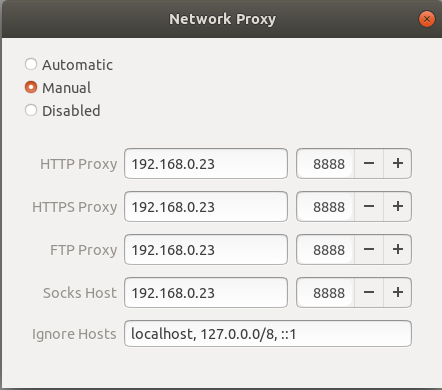
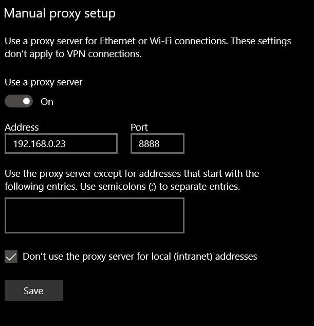

# Install the Squid proxy and caching server

## Overview
Duration: 2:00

In this tutorial, we will cover how to install the [Squid][squid] caching and proxy server. Caching proxies, like Squid, store local copies of web pages and steer new requests to these, speeding up load times and reducing the burden on your internet connection. 

### Learn how to:

* Install and configure Squid
* Connect to the proxy from a client

### Requirements

Alongside a computer running Ubuntu 16.04 (Xenial) or later, you will need the following:

* An updated *apt* package list (you can do this in the terminal using `sudo apt-get update`)
* A basic understanding of how proxies and caching proxies work
* Basic knowledge of the command line
* A stable internet connection
* Local Area Network (LAN)

Survey
: How will you use this tutorial?
- Only read through it
- Read it and complete the exercises
: What is your current level of experience?
- Novice
- Intermediate
- Proficient

## Install Squid
Duration: 1:00

Installing *Squid* is as simple as typing the following into a terminal:

```bash
sudo apt-get install squid
```

That's It! Continue to the next page to learn how to configure Squid.

## Configure Squid
Duration: 5:00

We now need to edit the Squid configuration file. As the default file is large, we recommend moving this to a backup first and replacing it with our own configuration:

```bash
cd /etc/squid
sudo mv squid.conf squid.conf_original
```

You can paste the following into an empty text file called *squid.conf* by first typing `sudo nano squid.conf`, pasting in the content, and using `ctrl`+`w` to save and exit the editor.

Here's what *squid.conf* should look like:

```bash
http_port 8888

acl localnet src 10.0.0.0/8     # RFC1918 possible internal network
acl localnet src 172.16.0.0/12  # RFC1918 possible internal network
acl localnet src 192.168.0.0/16 # RFC1918 possible internal network
acl localnet src fc00::/7       # RFC 4193 local private network range
acl localnet src fe80::/10      # RFC 4291 link-local (directly plugged) machines

acl SSL_ports port 443          # SSL

acl Safe_ports port 80          # http
acl Safe_ports port 21          # ftp
acl Safe_ports port 443         # https
acl Safe_ports port 70          # gopher
acl Safe_ports port 210         # wais
acl Safe_ports port 280         # http-mgmt
acl Safe_ports port 488         # gss-http
acl Safe_ports port 591         # filemaker
acl Safe_ports port 777         # multiling http
acl Safe_ports port 1025-65535  # unregistered ports


acl CONNECT method CONNECT

http_access deny !Safe_ports
http_access deny CONNECT !SSL_ports
http_access allow localhost manager
http_access deny manager

#
# INSERT YOUR OWN RULE(S) HERE TO ALLOW ACCESS FROM YOUR CLIENTS
#

http_access allow localnet
http_access allow localhost
http_access allow Safe_ports
http_access allow all
http_access deny all

coredump_dir /squid/var/cache/squid

refresh_pattern ^ftp:           1440    20%     10080
refresh_pattern ^gopher:        1440    0%      1440
refresh_pattern -i (/cgi-bin/|\?) 0     0%      0
refresh_pattern .               0       20%     4320
```
If you're in the mood to hack a little, all the options are described on the [Squid cache website][squid-cache] and can be changed to fit your needs.

## Set up a connection
Duration: 5:00

positive
: If you're connecting to your Squid server from an external network, make sure port *8888* is forwarded to the server and that the firewall allows connections to the port. You can do this with `sudo ufw allow 8888`.

To connect to your Squid proxy, you need to edit the network configuration on the computer(s) you want to use the proxy.

### Ubuntu

On Ubuntu, open *Settings>Network>Network Proxy* and click the gear icon. Select *Manual* and enter the IP address of your Squid server.



### Windows

On Windows 10, proxy settings can be found by selecting *Settings>Network and Internet>Proxy>Manual Proxy Setup*. Enter the IP address of your Squid server and make sure 'Use a proxy server' is enabled.



### iOS

On iOS 11, proxies can be configured by selecting your network, selecting *Configure Proxy*, setting this to *Manual* and entering the IP address of your server. You also need to enter *8888* as the port.


## You're Done!
Duration: 2:00

Congratulations! When your machine now requests a page over either HTTP or HTTPS, you will be transparently served cached web pages from your proxy.

The underlying program, Squid, has many other features, including filtering using Access Control Lists (ACL). These are documented on the [Squid website][squid-cache].

### You now know how to:

* Prepare an environment to install a caching proxy
* Install and configure Squid

### What's Next?

* Modify your external internet connection to forward port 8888
* Ensure your network has a static IP address
* Set up a connection to your proxy on common distributions

### I Need Help

* Check that the port (8888) is available
* Check your router's port forwarding configuration (external connection)
* Ensure the configuration file is correct
* Make sure you typed the commands properly
* Try using *sudo* (if you aren't already) i.e. `sudo` + `command`
* Ask a question on [Ask Ubuntu][ask-ubuntu]

<!-- LINKS -->
[squid]: http://www.squid-cache.org/
[squid-cache]: http://www.squid-cache.org/Versions/v4/cfgman/index.html#toc_acl
[ask-ubuntu]: https://askubuntu.com/questions/ask
